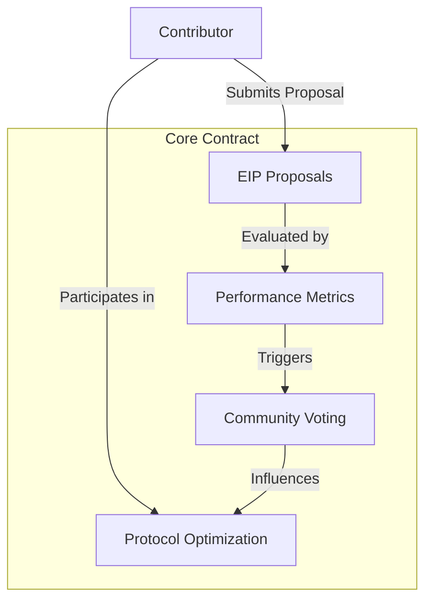

# Nano EIP Optimizer

A decentralized framework for systematically tracking, analyzing, and proposing optimizations to Ethereum Improvement Proposals (EIPs).

## Overview

Nano EIP Optimizer is a blockchain-powered platform designed to:
- Track and analyze Ethereum Improvement Proposals
- Provide a collaborative environment for protocol optimization
- Create verifiable records of EIP contributions
- Incentivize high-quality protocol improvement proposals

The platform creates a transparent, community-driven mechanism for Ethereum protocol evolution, enabling researchers and developers to contribute meaningfully to Ethereum's ongoing development.

## Architecture

The system is built around a core smart contract that manages:
- EIP proposal tracking
- Contribution verification
- Performance metric analysis
- Community voting and ranking



## Contract Documentation

### Core Contract (eip-optimizer.clar)

The main contract managing Nano EIP Optimizer functionality.

#### Key Features
- EIP proposal submission and tracking
- Performance metric analysis
- Community-driven voting mechanism
- Contribution verification system

#### Proposal Categories
1. Protocol Performance
2. Gas Optimization
3. Security Enhancements
4. Scalability Improvements
5. Economic Model Refinements

## Getting Started

### Prerequisites
- Clarinet
- Ethereum protocol development tools
- Stacks wallet for contract interaction

### Basic Usage

1. Submit an EIP proposal:
```clarity
(contract-call? .eip-optimizer submit-eip-proposal 
    "Gas Optimization" ;; category
    "Reduce transaction overhead" ;; title
    "Proposed method to minimize gas consumption..." ;; description
    none ;; optional metadata
)
```

2. Vote on a proposal:
```clarity
(contract-call? .eip-optimizer vote-on-proposal 
    u42   ;; proposal ID
    true  ;; vote (true = support, false = oppose)
)
```

## Function Reference

### Public Functions

#### submit-eip-proposal
```clarity
(define-public (submit-eip-proposal 
    (category (string-utf8 64)) 
    (title (string-utf8 128)) 
    (description (string-utf8 1024)) 
    (metadata (optional (string-utf8 256)))
)
```
Submits a new Ethereum Improvement Proposal for community review.

#### vote-on-proposal
```clarity
(define-public (vote-on-proposal (proposal-id uint) (support bool))
```
Allows community members to vote on existing proposals.

#### analyze-proposal
```clarity
(define-public (analyze-proposal (proposal-id uint))
```
Triggers a comprehensive analysis of a specific proposal.

### Read-Only Functions

#### get-proposal-details
```clarity
(define-read-only (get-proposal-details (proposal-id uint))
```
Retrieves comprehensive details about a specific EIP proposal.

#### get-contributor-stats
```clarity
(define-read-only (get-contributor-stats (contributor principal))
```
Retrieves contribution statistics for a specific contributor.

## Development

### Testing
1. Install Clarinet
2. Run the test suite:
```bash
clarinet test
```

### Local Development
1. Start a local Clarinet console:
```bash
clarinet console
```
2. Deploy contracts:
```clarity
(contract-call? .eip-optimizer ...)
```

## Security Considerations

### Limitations
- Proposal submissions limited to registered contributors
- Voting power proportional to past contributions
- Proposal analysis complexity managed through gas limits

### Best Practices
- Thoroughly review proposals before voting
- Validate technical feasibility of proposed changes
- Maintain transparency in voting and analysis processes
- Respect Ethereum's existing governance frameworks